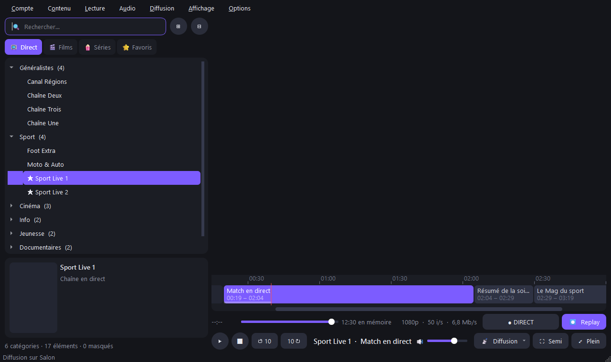

# KFluxTV

**Lecteur IPTV Xtream Codes pour Windows** : TV en direct, films, séries, guide des programmes, direct différé (pause / retour arrière), favoris et diffusion sur la télé (Chromecast, Google TV, Fire TV).

[](https://github.com/KisakePro/KFluxTV/releases/latest)


> **KFluxTV ne fournit aucun contenu.** C'est uniquement un lecteur : il faut ses propres identifiants Xtream Codes (serveur, utilisateur, mot de passe) fournis par son abonnement IPTV.



*Capture réalisée avec des données fictives.*

---

## Sommaire

- [Fonctionnalités](#fonctionnalités)
- [Installation](#installation)
- [Premiers pas](#premiers-pas)
- [Diffuser sur la télé](#diffuser-sur-la-télé)
- [Raccourcis clavier](#raccourcis-clavier)
- [Options](#options)
- [Dépannage](#dépannage)
- [Données et confidentialité](#données-et-confidentialité)
- [Compiler depuis les sources](#compiler-depuis-les-sources)

---

## Fonctionnalités

### Bibliothèque
- Trois onglets **📺 Direct**, **🎬 Films** et **🍿 Séries**, rangés par catégories, comme sur le compte du fournisseur
- **Recherche** instantanée dans l'onglet affiché
- **Fiche** de l'élément sélectionné : affiche, note, genre, durée, résumé (logo pour les chaînes)
- Séries : saisons et épisodes chargés à l'ouverture
- **Masquer** des chaînes, films, séries ou catégories entières (clic droit), avec une fenêtre pour les réafficher
- Boutons **⊞ / ⊟** pour tout développer ou tout réduire

### ⭐ Favoris
- Onglet dédié pour les chaînes, films et séries préférés (clic droit ou `Ctrl+D`)
- **Groupes** de favoris : création, renommage, suppression, rangement par glisser-déposer
- Favoris enregistrés séparément pour chaque compte

### Lecture
- Lecteur intégré, choix de la **sortie audio**, coupure du son
- Mode **semi plein écran** (la vidéo remplit la fenêtre) et vrai plein écran
- Barre de progression et sauts de 10 s pour les films et épisodes
- **Qualité réelle** du flux affichée (résolution, images par seconde, débit) : pratique pour vérifier qu'une chaîne « FHD » l'est vraiment

### ⏺ Replay (direct différé)
- **Pause, retour arrière et retour au direct** sur les chaînes en direct
- Le flux est enregistré tel quel sur le disque (aucune conversion, même qualité qu'en direct)
- Durée gardée en mémoire et délai de sécurité anti-saccades réglables
- Bouton **⏺ Replay** sous le lecteur pour l'activer ou le couper à tout moment

### Guide des programmes
- **Bandeau chronologique** sous la vidéo : programme en cours, suivants, heure actuelle
- Survol d'un programme pour lire son résumé
- Le titre du lecteur affiche la chaîne et le programme en cours

### 📡 Diffusion sur la télé
- Chromecast, Google TV / Android TV et **Fire TV** (avec l'application AirScreen)
- Conversion automatique quand la télé ne sait pas lire un flux, et plusieurs méthodes essayées tour à tour si rien ne démarre
- **Une seule connexion au fournisseur**, même pendant la diffusion : compatible avec les abonnements limités à 1 connexion

### Comptes et mises à jour
- Plusieurs comptes Xtream, connexion automatique au dernier utilisé
- Accepte aussi un lien M3U complet (`get.php?username=…&password=…`)
- Informations du compte : statut, date d'expiration, connexions utilisées
- **Mise à jour intégrée** : l'application propose les nouvelles versions publiées ici

---

## Installation

Télécharge la dernière version sur la page **[Releases](https://github.com/KisakePro/KFluxTV/releases/latest)** :

| Fichier | Pour qui |
|---|---|
| `KFluxTV-Setup-x.y.z.exe` | **Recommandé.** Installe KFluxTV pour ton compte Windows (pas besoin de droits administrateur), avec raccourcis Bureau / menu Démarrer et désinstallation depuis les Paramètres Windows. |
| `KFluxTV-Portable-x.y.z.exe` | Un seul fichier à lancer directement, sans installation (clé USB, PC partagé…). |

Windows 10 ou 11, 64 bits. Rien d'autre à installer : le lecteur vidéo et ffmpeg sont inclus.

> **Avertissement de Windows SmartScreen** : l'application n'est pas signée numériquement, Windows peut donc afficher « Windows a protégé votre ordinateur ». Clique sur **Informations complémentaires** puis **Exécuter quand même**.

---

## Premiers pas

1. Lance KFluxTV, puis ouvre **Compte → Gérer les comptes** (`Ctrl+P`) et clique **Ajouter…**
2. Renseigne le **serveur** (`http://serveur:port`), l'**utilisateur** et le **mot de passe** fournis par ton abonnement — ou colle directement ton lien M3U complet dans le champ Serveur
3. Clique **Se connecter** : les catégories et chaînes se chargent dans l'onglet **Direct**
4. **Double-clic** sur une chaîne pour la regarder

Aux lancements suivants, KFluxTV se reconnecte automatiquement au dernier compte utilisé.

---

## Diffuser sur la télé

1. Le PC et la télé doivent être sur le **même réseau** (Wi-Fi ou câble)
2. Clique **📡 Diffusion** sous le lecteur → **Rechercher les appareils…**, puis choisis ta télé
3. Lance une chaîne, un film ou un épisode : il s'affiche sur la télé. Pour revenir sur le PC, choisis **🖥 Ce PC** dans le même menu

| Télé | Ce qu'il faut |
|---|---|
| Chromecast, Google TV, Android TV | Rien, elle apparaît directement |
| **Fire TV** | Installer l'application gratuite **AirScreen** (Amazon Appstore), l'ouvrir et activer **Google Cast** dans ses réglages. Le récepteur AirPlay intégré aux Fire TV n'accepte pas de vidéo venant d'un PC. |

Au premier envoi, Windows peut demander d'autoriser KFluxTV dans le pare-feu : accepte pour les **réseaux privés**, sinon la télé ne peut pas recevoir la vidéo. Le PC doit rester allumé pendant la diffusion : c'est lui qui relaie le flux vers la télé.

---

## Raccourcis clavier

| Touche | Action |
|---|---|
| `Espace` | Lecture / pause |
| `Ctrl+←` / `Ctrl+→` | Reculer / avancer de 10 s |
| `Ctrl+L` | Revenir au direct |
| `M` | Couper le son |
| `F` | Semi plein écran (la vidéo remplit la fenêtre) |
| `F11` | Plein écran |
| `Échap` | Quitter le plein écran / semi plein écran |
| `Ctrl+D` | Ajouter / retirer des favoris |
| `Ctrl+E` / `Ctrl+Maj+E` | Tout développer / tout réduire |
| `Ctrl+P` | Gérer les comptes |
| `F5` | Recharger les listes |
| `Ctrl+,` | Options |
| `Ctrl+Q` | Quitter |

Double-clic sur la vidéo : semi plein écran.

---

## Options

Menu **Options → Paramètres…**

- Connexion automatique au dernier compte au démarrage
- Recherche des mises à jour au démarrage
- **Direct différé** (Replay) : activation, durée gardée en mémoire (60 min par défaut), délai de sécurité anti-saccades (20 s par défaut)
- Accès au dossier des données

Menu **Diffusion → Compatibilité TV** : conversion automatique (recommandé), toujours convertir, ou jamais.

---

## Dépannage

**« Connexions du compte saturées (1/1) »**
Ton abonnement n'autorise qu'un nombre limité de connexions simultanées et elles sont déjà utilisées : un autre appareil regarde avec le même compte, ou le fournisseur n'a pas encore libéré la chaîne précédente. Ferme les autres lecteurs et réessaie après quelques secondes. *Compte → Informations du compte* affiche les connexions utilisées.

**L'image saccade**
Les fournisseurs envoient souvent les images par à-coups. Garde le **Replay** activé et augmente le *délai de sécurité anti-saccades* dans les Options (30 s par exemple). Sans Replay, l'application lit le flux direct.

**Une chaîne « FHD » paraît floue**
Regarde la qualité affichée sous le lecteur : certains fournisseurs nomment « FHD » des chaînes envoyées en 720p à faible débit. L'application ne peut pas faire mieux que la source ; essaie une autre version de la chaîne (HD, 4K…).

**La télé n'apparaît pas dans Diffusion**
Vérifie que le PC et la télé sont sur le même réseau, que le pare-feu Windows autorise KFluxTV (réseaux privés) et, sur Fire TV, qu'AirScreen est ouverte avec Google Cast activé.

**Pas de son**
Choisis la bonne sortie dans le menu **Audio** (le choix est mémorisé).

---

## Données et confidentialité

- Comptes et réglages : `%APPDATA%\KFluxTV` (`profiles.json`, `settings.json`)
- Les **mots de passe sont chiffrés** avec la protection des données de Windows : ils ne sont lisibles que par ta session Windows
- Les identifiants sont masqués dans les messages d'erreur affichés
- Le Replay enregistre temporairement le flux dans le dossier temporaire de Windows ; ces fichiers sont supprimés à l'arrêt de la lecture et au démarrage suivant
- KFluxTV ne contacte que **ton fournisseur IPTV** et **GitHub** (vérification des mises à jour). Aucune statistique, aucun compte à créer

---

## Compiler depuis les sources

Prérequis : Windows, Python 3.12 ou plus récent.

```powershell
pip install -r requirements.txt
powershell -ExecutionPolicy Bypass -File build.ps1
```

Les deux exécutables sont produits dans `release/`.

| Fichier | Rôle |
|---|---|
| `iptv.py` | L'application (interface PySide6 / Qt) |
| `installer.py` | L'installateur (`KFluxTV-Setup`) |
| `build.ps1` | Compilation de l'application, de la version portable et de l'installateur (PyInstaller) |

**Publier une version** : modifier `VERSION` dans `iptv.py`, compiler, puis créer une release dont le tag est `v<VERSION>` avec les deux fichiers `.exe` (leur nom doit contenir `Setup` et `Portable` pour que la mise à jour intégrée les trouve). La mise à jour automatique interroge la dernière release : le dépôt doit être public.
